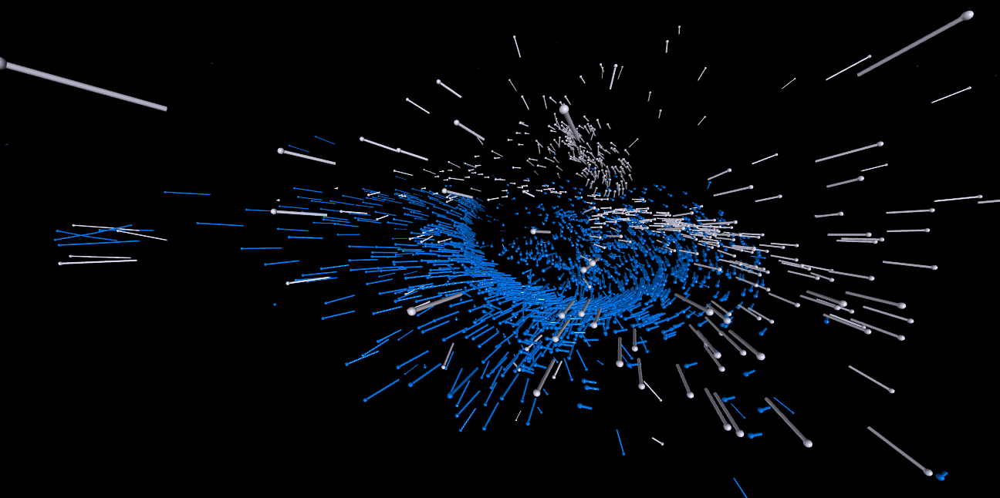
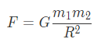
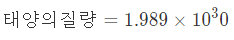
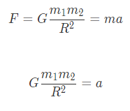
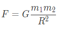
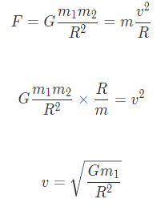
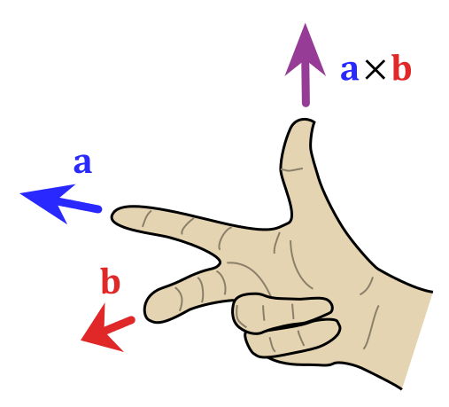

# Vpython을 이용한 안드로메다 우리 은하 충돌 시뮬레이션 


<p align="center">
  <br/>
</p>

- [Vpython을 이용한 안드로메다 우리 은하 충돌 시뮬레이션](#vpython을-이용한-안드로메다-우리-은하-충돌-시뮬레이션)
  - [install      설치](#install------설치)
  - [Dev Enviorment](#dev-enviorment)
  - [내가이걸 왜 만들었나....](#내가이걸-왜-만들었나)
  - [내가 이걸 안만들었다 라고 생각할까봐 준비했다.](#내가-이걸-안만들었다-라고-생각할까봐-준비했다)
    - [상수](#상수)
    - [함수](#함수)
      - [리미터](#리미터)
      - [가속도](#가속도)
      - [만유인력](#만유인력)
    - [클래스](#클래스)
      - [은하](#은하)
        - [별 위치 구하기](#별-위치-구하기)
        - [공전 속도 구하기](#공전-속도-구하기)
        - [실제 속도 구하기](#실제-속도-구하기)
        - [별 생성 신호](#별-생성-신호)
      - [별](#별)
    - [진짜 실행](#진짜-실행)
- [끝](#끝)


## install      설치
```
git clone https://github.com/kevincho0316/Andromeda-Milky-Way-collision.git
```
```
pip install -r requirements.txt
```
To start simulation run:
```
python3 main.py
```

## Dev Enviorment

- 운영체제: Window10
- 사용언어: python 3.6.0
- 사용 라이브러리 vpython, math, random, numpy


## 내가이걸 왜 만들었나....
절대 정보 수행을 잘받고싶어서가 아니라.
> **최근**에 인터넷을 통해 안드로메다 은하와 우리 은하의 충돌을 알게 되었습니다. 현제 대부분의 은하가 우리 은하로부터 멀어져 가고 있지만 안드로메다은하는 초속 120km로 우리 은하와 24억년후 충돌할 것이라고 설명하는 글을 보고 흥미를 느껴서 이를 더 찾아보니 NASA (미항공우주국)에서 만든 시뮬레이션을 찾을 수 있었고 이에 흥미를 느껴 이와 비슷한프로그램을 만들기로 다짐하였습니다. 그후 정보시간에 Vpython을 배웠고 이를 기반으로 하여 시뮬레이터를 만들어 보았습니다.

***

## 내가 이걸 안만들었다 라고 생각할까봐 준비했다.
### 상수
```
G = 6.673e-11
```
위는 모두가 알다 싶이 중력 상수입니다. 이 코드의 핵심 공식인 
만유인력을 사용하기 위해서는 필수적인 부분이지요 ↘. 
<p align="center">
  <br/>
  ↑ 만유인력 공식 
</p>

***
```
MIN_SolarMass = SolarMass * 0.09
MAX_SolarMass = SolarMass * 256
AVG_SolarMass = SolarMass * 0.3
```

별들의 질량의 기준값을 태양의 질량으로 계산하려고합니다.

<p align="center">
  <br/>
</p>

이를 기준으로 질량이 큰 항성인 **R136a1**의 질량인 **260 M☉**. 이말은 즉, 태양의 260배의 질량을 가지고 있습니다.이를 최대 별의 질량으로 잡고 최소 별의 질량은 ESO에서 발견한 **OGLE-TR-122b**를 기준으로 하였습니다. 이의 질량은 태양의 **9%** 입니다. 그리고 평균 질량은 태양의 **25%~30%** 정도라고 추정 되는데 이는 우리은하의 별의 개수와 총질량을 기반으로 구한 값이라고 합니다.  

***
```
kScale = 3.086e16  # 1e20 
```
요것은 일종의 단위라고 보시면 됩니다. 워낙 큰수를 가지고 계산을 하니 이를 도와주신다고 보면됩니다.
***
```
MILKY_WAY_GALAXY_THICKNESS = kScale * 0.4
ANDROMEDA_GALAXY_THICKNESS = kScale * 67
```
우리 은하의 두께를 40:67 정도의 비율을 가지고 있기에 다음과 같이 적었습니다. 
***
```
STAR_RADIUS = 0.025
distance = 1e17
```
별로 표현되는 구의반지름을 설정하는등 그래칙 관련 설정합니다.

***
### 함수
####  리미터
```
def Limiter(x, low, high):
    return max(min(x,high), low)
```
다음은 함수 파트입니다. 가장 위에 있는 함수는 Limiter입니다. 본 함수는 제목 그대로 x를 low와 high 사이로 x를 제한하는 역할을 합니다.
***
####  가속도
```
def gravity_acceleration(mass, radius):
    radius = max(radius, MIN_Orbit_RADIUS)
    return G * mass / radius**2     


def acceleration(obj, galaxy):
    r_galaxy = galaxy.pos - obj.pos
    return r_galaxy.norm() * gravity_acceleration(galaxy.mass, r_galaxy.mag)        
```
가속도 관련 함수로서 다음과 같은 공식을 따라갑니다.
<p align="center">
  <br/>
</p>
요렇게 해서 가속도를 구합니다.
***
####  만유인력
```
def gravity(mass1, mass2, radius):
    return G * mass1 * mass2 / radius**2  #만유인력 법칙 F = G m1 m2 / r²
```
만유인력을 그냥 코딩으로 그대로 적은것입니다.

<p align="center">
  <br/>
</p>

~~OOga BooGa Caveman brain~~
***
### 클래스
**코딩을 제과로 비유하자면 클라스는 제과 빵의 틀과 비슷합니다. 코드의 양을 대폭 줄여주는 역할을 한다.**
***
#### 은하 
##### 별 위치 구하기 
```
class Galaxy(object):
    def __init__(self, num_stars, pos, vel, radius, thickness, color): #변수 입력 받음
        self.pos = pos
        self.vel = vel
        self.radius = radius

        # 가우스 분포로 별 질량을 별 개수만큼 생성 생성
        masses = [Limiter(gauss(mu=AVG_SolarMass, sigma=AVG_SolarMass / 3.0), MIN_SolarMass, MAX_SolarMass)
                  for i in range(num_stars)]    #뒤에 반복문 달아도 반복이 됨 코드 양을 줄임

        # 은하의 질량이 전체 별의 질량이기에 이를 전체 더해준다.
        self.mass = fsum(masses)

        # 가우스 분포의 위치 시그마 xyz
        S_x = radius * 0.1
        S_y = thickness * 0.10
        S_z = radius * 0.1

        positions = []
        for i in range(num_stars):
            pos = vector(
                Limiter(gauss(mu=0, sigma=S_x), -radius, radius),
                Limiter(gauss(mu=0, sigma=S_y), -thickness, thickness),
                Limiter(gauss(mu=0, sigma=S_z), -radius, radius)
            )

            # 입자가 무지성으로 날아다니는걸 막음
            if pos.mag < MIN_Orbit_RADIUS:
                pos.mag = MIN_Orbit_RADIUS

            positions.append(pos)


```
첫번째는 은하 클라스입니다. 여기서는 은하 안에 있는 별들의 위치를 제작한다고 볼 수 있습니다. 이 프로그램은 가우스 분포를 이용해 별들의 위치를 만들어냅니다. 본 방법을 이용한 이유는 별들은 중력 때문에 은하의 중심에 더 모이게 되고 은하의 외곽에는 별이 많이 없는데 이를 나타낼 수 있는 것이 가우스 분포이기 때문입니다.
  <p align="center">
    <br/>
  다변량 가우시안 정규분포
</p>
🙄뭔 그래프인지 정확히 모름

##### 공전 속도 구하기 
```
        def orbital_Vel(center_mass, radius):               
            return sqrt(G * center_mass / radius)           

```

밑에 처럼 v의 값을 구하는 모습입니다.

<p align="center">
  <br/>
</p>

##### 실제 속도 구하기
여기가 코드 중에서 가장 어려운 부분이라고 생각합니다.
<p align="center">
  <br/>
</p>

```
                # 별 리스트 생성
        stars = []
        
        up = vector(0.0, 1.0, 0.0)  #위를 향하는 벡터 속도를 구할때 써야함
```
약간의 세팅을 해줍니다.
```
        for i in range(num_stars):
            # 정규화된 벡터를 이동방향에 따라 계산함                                                     
            a_pos = positions[i] + self.pos      #실제 좌표에서의 별의 위치
            r_pos = positions[i]                 #은하 내에서의 상대적 별의 위치
```
은하를 기준으로 하는 좌표값과 생 좌표값을 만듦니다.


```            
            vec = r_pos.cross(up).norm()         #위를 향하는 벡터와 은하으로 부터의 위치를 곱한다.이거는 공이 움직이는 방향만을 나타낸다.   
            
            r_vel = vec * orbital_Vel(self.mass, r_pos.mag) # 위에서 공의 방향을 구했으니 이를 속도와 곱해서 벡터(힘과 방향을 복합적으로 나타냄)를 구한다. 
            a_vel = r_vel + vel           #실제 속도를 구한다. 상대적인 속도와 은하의 속도를 더함으로써
```
벡터의 곱은 
<p align="center">
  <br/>
</p>

이따구 이기에 입자가 향하는 방향을 알수있습니다. 
그리고 방향에다가 상대적인 속도를 곱해서 방향과 크기를 모두 가지는 진정한(?) 백터를 만든후
은하의 속도에 상대적인 속도를 더해서 실질적 속도를 구합니다. 

##### 별 생성 신호

```

            stars.append(Star(                          #구를 만들어달라고 신청을 한다.
                mass=masses[i],
                radius=STAR_RADIUS,
                pos=absolute_pos,
                vel=absolute_vel,
                color=color,
                
            ))

        self.stars = np.array(stars)

```

별 생성을 하고 리스트에 추가합니다.

***

#### 별

```
class Star(object):
    def __init__(self, mass, radius, pos, vel, color):
        self.obj = sphere(pos=pos / kScale, radius=radius, color=color, make_trail = True, retain=3)     #구 만들기
        self.mass = mass
        self.vel = vel
        self._pos = pos

    @property
    def pos(self):
        return self._pos

    @pos.setter
    def pos(self, value):
        self.obj.pos = value / kScale
        self._pos = value

    def __str__(self):
        return "Mass: " + str(self.mass) + "\nPos: " + str(self.pos) + \
            "\nVel: " + str(self.vel)

```

말그대로 별을 생성 하는 부분입니다. 질량 색상 등의 요청에 맞추어 이를 생성합니다.

```@property```

는 코드의 양을 줄여주는 장치로 신기함.. 하여튼 그럼 

***

### 진짜 실행 

~~그럼 가짜로 실행하니?~~
여기는 비교적 쉬우니 빨리 넘어가쟈

```
    t = 0
    milky_way = Galaxy(
        num_stars=NumOfStar_MIlky,
        pos=vector(-3, 0, 0) * kScale,
        vel=vector(0, 0, 0),
        radius=MAX_Orbit_RADIUS,
        thickness=MILKY_WAY_GALAXY_THICKNESS,
        color=vector(1, 0, 0)
    )
    andromeda = Galaxy(
        num_stars=NumOfStar_Andromeda,
        pos=vector(3, 0, 0) * kScale,
        vel=vector(0, 3, 0),
        radius=MAX_Orbit_RADIUS,
        thickness=ANDROMEDA_GALAXY_THICKNESS,
        color=vector(0, 0, 1)
    )
```

클래스 호출해서 은하 만듭니다.

```
    while True:
        rate(100)

        mag_difference = milky_way.pos.mag - andromeda.pos.mag  #크기 차이

        # amda.pos = andromeda.pos
     
        for i in range(len(milky_way.stars)):
            star = milky_way.stars[i]
            star.vel += acceleration(star, andromeda) * distance + acceleration(star, milky_way) * distance
            star.pos += star.vel * distance
            if i == 35:
                star

            

        andromeda_mask = np.zeros(len(andromeda.stars))

        for star in andromeda.stars:
            star.vel += acceleration(star, milky_way) * distance + acceleration(star, andromeda) * distance
            star.pos += star.vel * distance
```

요거는 이제 별들의 움직임을 마ㅏㅏㅏㄱ 계산하는 부분임니다. 

```
        milky_way.vel += acceleration(milky_way, andromeda) * distance
        milky_way.pos += milky_way.vel * distance

        andromeda.vel += acceleration(andromeda, milky_way) * distance
        andromeda.pos += andromeda.vel * distance

        t += distance
```

은하의 움직임을 계산합니다.


# 끝
<small><i><a href='http://ecotrust-canada.github.io/markdown-toc/'>Table of contents generated with markdown-toc</a></i></small>
