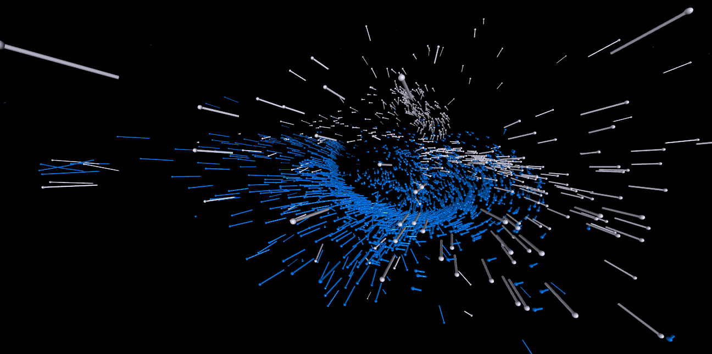

# Vpython_Andromeda-Milky-Way-collision         Vpython을 이용한 안드로메다 우리 은하 충돌 시뮬레이션 
## Install     
<p align="center">
  <br/>
</p>

```
git clone https://github.com/kevincho0316/Andromeda-Milky-Way-collision.git
```

```
pip install -r requirements.txt
```

To start simulation run:

```
python3 main.py
```
